# scry-ui

A web UI for [`scry`][scry] — the single-binary code search index for AOSP +
Linux. Mithril SPA in front of an Express proxy that wraps `scry serve`. No
modifications to the indexer itself; the daemon is the only thing this
process owns.

It's cs.android.com-shaped: dense file-grouped results, monospace-forward,
search-as-you-type, keyboard nav, a dashboard with the index manifest +
query latencies, and live log tails for the indexer's writers.

[scry]: https://github.com/fiveapplesonthetable/scry

## Screenshots

| Search results | Definition lookup with autocomplete |
| --- | --- |
| 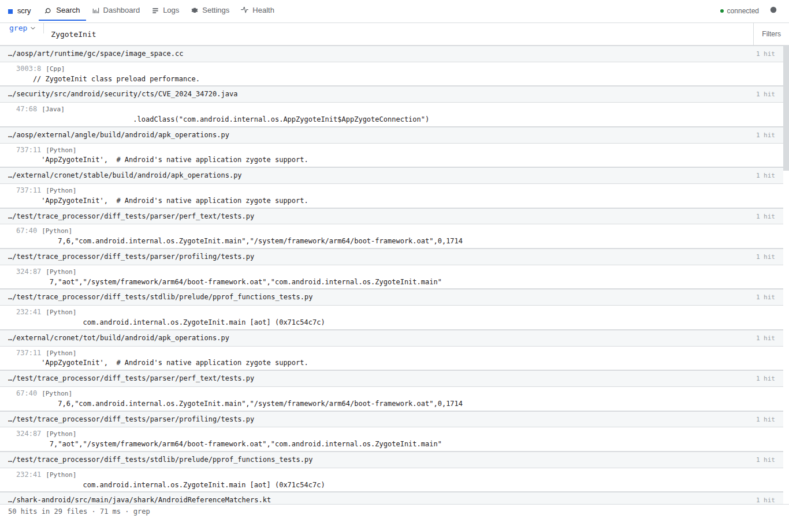 | 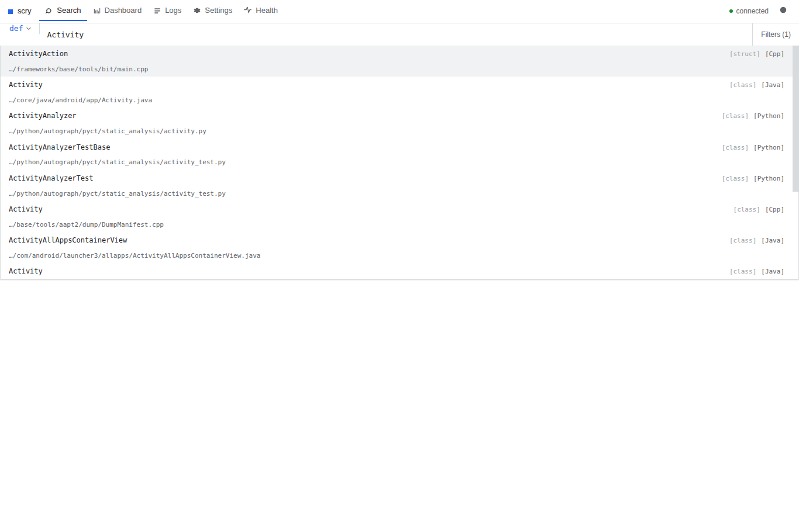 |

| File peek inline | Command picker |
| --- | --- |
| 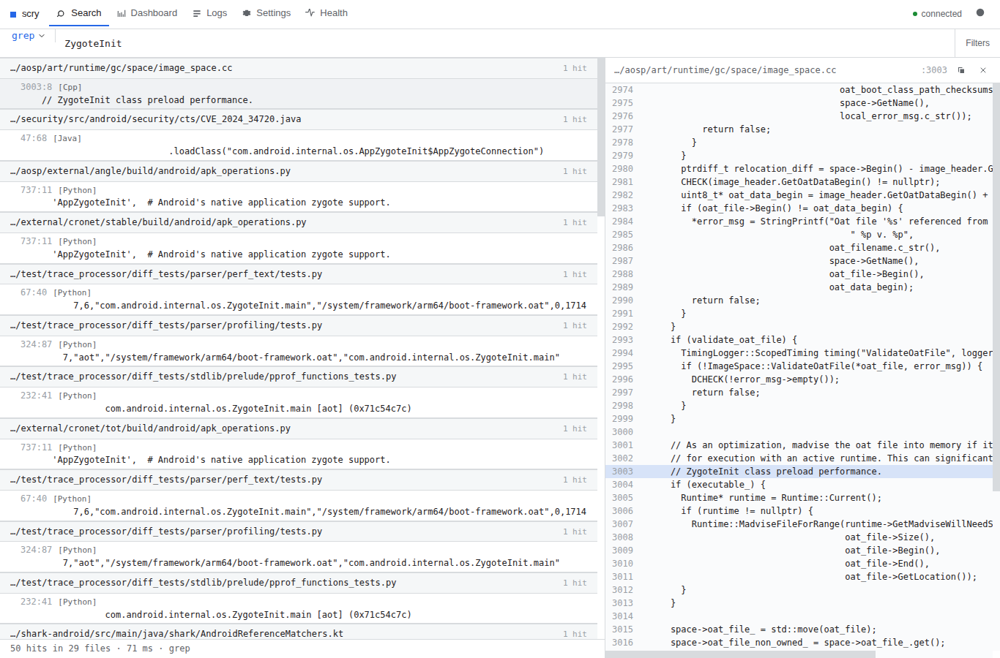 | 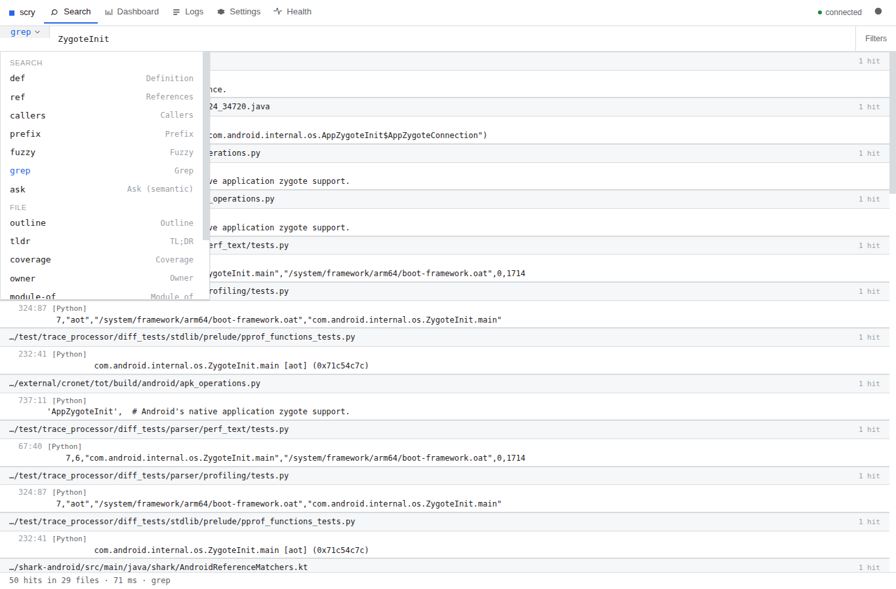 |

| Dashboard — latency, sidecars, roots | Health — daemon state + stderr |
| --- | --- |
| 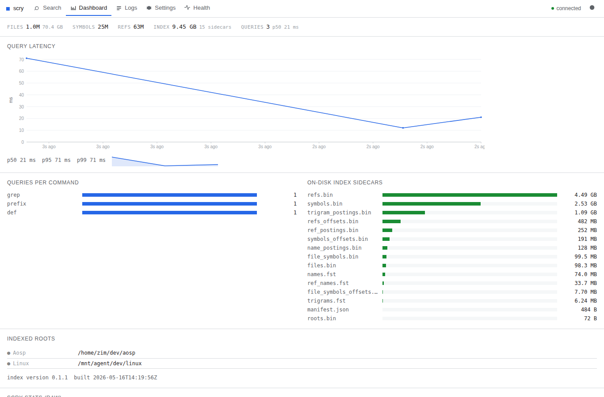 | 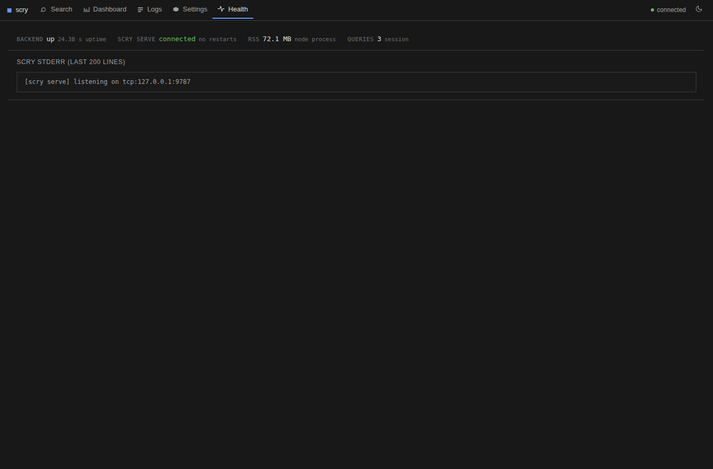 |

| Logs — live SSE tail | Settings — index/bin/port/theme |
| --- | --- |
| 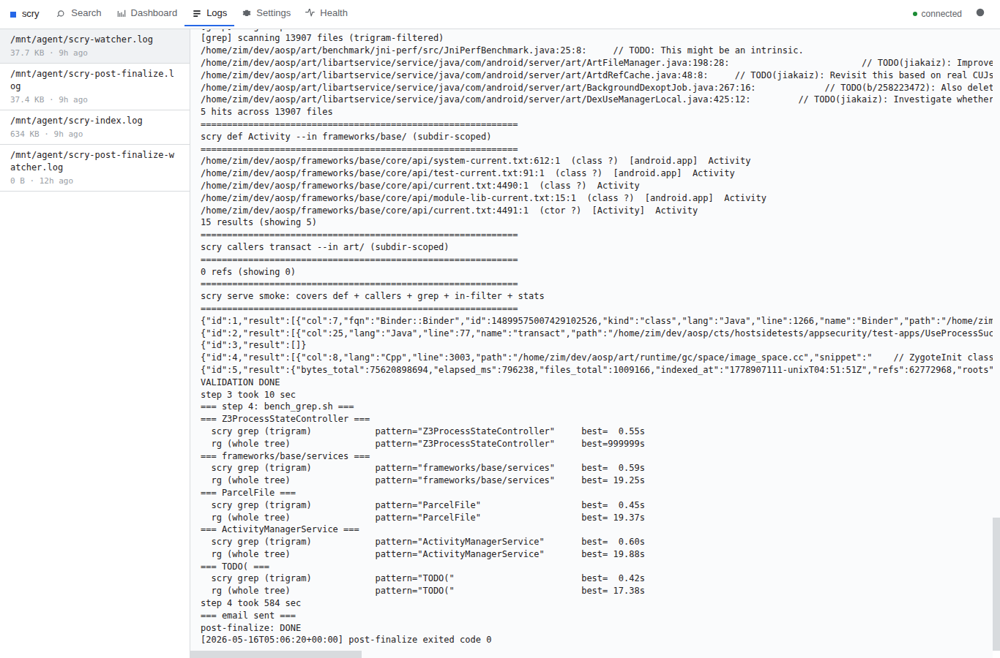 | 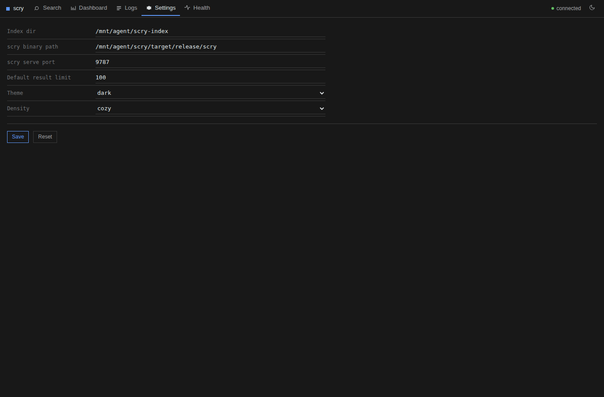 |

| Phone — results | Phone — file overlay | Phone — dashboard |
| --- | --- | --- |
| 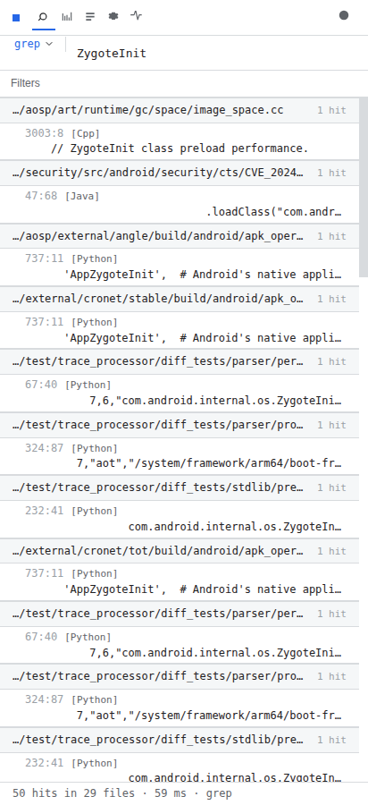 | 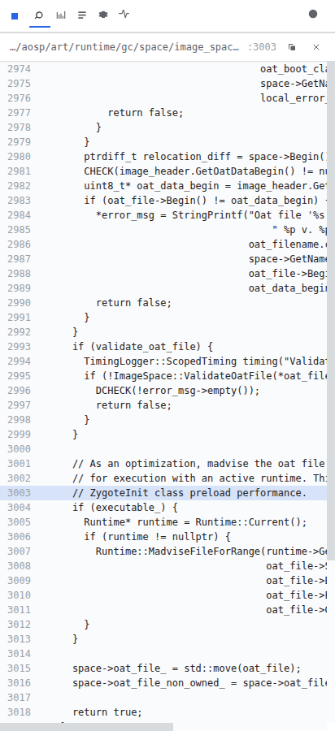 | 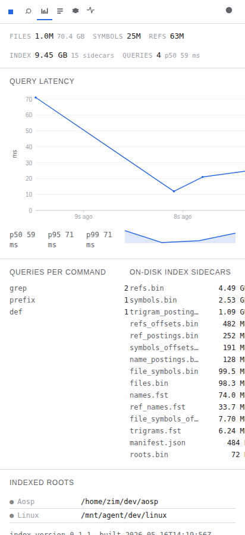 |

## Quickstart

```sh
git clone https://github.com/fiveapplesonthetable/scry-ui
cd scry-ui
npm install
npm start                      # http://0.0.0.0:8787
```

`scry` and an index need to already exist. By default the UI looks for the
binary at `/mnt/agent/scry/target/release/scry` and the index at
`/mnt/agent/scry-index` — change either from the Settings page, or edit
`~/.scry-ui/settings.json` directly. Build scry first if you need to:

```sh
git clone https://github.com/fiveapplesonthetable/scry
cd scry && cargo build --release
# index a tree:
./target/release/scry index ~/dev/aosp -o ~/scry-index --build-trigrams
```

## Features

- **All scry verbs behind one picker.** `def`, `ref`, `callers`, `prefix`,
  `fuzzy`, `grep`, `ask`, `outline`, `tldr`, `coverage`, `owner`,
  `module-of`, `recall`, `diff` — each gets the right argument form
  (lang, in-prefix, kind, regex, distance, …) and a `Filters (N)` toggle
  that shows how many of them are active.
- **File-grouped results, cs.android.com-shaped.** Hits group by file
  with a sticky header showing the path + hit count. Each hit is
  `line:col  [kind] [lang]  name` over the snippet. The footer is one
  line: `N hits in M files · Xms · cmd`. Files are bracketed `[Java]`,
  `[class]`, etc — no pill chips, no card chrome.
- **Search-as-you-type autocomplete.** Typing into a symbol-shaped query
  (`def`/`ref`/`callers`/`prefix`/`fuzzy`) fires a debounced
  `scry prefix` lookup and shows the matches under the input — name +
  `[kind]` `[lang]` + path. ↑/↓ to walk, Enter to commit and run, Esc to
  dismiss. No suggestions for `grep`/`ask` (free text) or path commands.
- **File peek inline.** Clicking a result opens the file region around
  the hit in a side column, with line numbers and the matched line
  shaded. On narrow viewports the column slides over as an overlay.
  Esc closes.
- **Keyboard nav throughout.** `/` jumps to and selects the input from
  any page. `j`/`k` step through results. `Enter` opens the selected row.
  `Esc` cancels the autocomplete, then the file panel. Theme button
  cycles auto → light → dark.
- **Dashboard.** Inline KPI strip (`files · symbols · refs · index ·
  queries · p50`), a latency line chart with p50/p95/p99 markers,
  per-command call counts, on-disk sidecar sizes, indexed roots, and the
  raw `scry stats` dump. Sections are separated by hairlines, not
  cards.
- **Logs.** Discovers `scry*.log` under `/mnt/agent` and `/var/log` and
  live-tails the selected one over Server-Sent Events. ERROR / WARN
  lines are highlighted; the view auto-scrolls while pinned to the
  bottom.
- **Settings.** Index dir, scry binary path, scry-serve TCP port,
  default limit, theme, density — persisted to `~/.scry-ui/settings.json`.
  Changes that affect the daemon (index/bin/port) trigger an in-place
  restart of `scry serve` without dropping the HTTP server.
- **Health.** Backend uptime + RSS, scry-serve connection state, last
  restart, last 200 stderr lines from the daemon. Useful when something
  goes wrong and you want to see what the indexer was complaining about
  without `tail`-ing files.
- **Dark by default, light + auto themes.** Stored in `localStorage` and
  applied pre-paint via an inline script in `index.html` so there's no
  flash on load. Palette and typography mirror the Perfetto /
  trace-launcher family: Roboto + Roboto Mono, hairline borders, 0–2 px
  radii.
- **Reflows to phone.** Breakpoints at 760 / 720 / 520 px. Tab labels
  collapse to icons, the file panel becomes a full-screen overlay,
  dashboard sections stack, settings rows go single-column. Tested at
  1366×900 and 412×900.

## Architecture

```
browser  ──HTTP──▶  Express (/api/*)  ──TCP JSON-RPC──▶  scry serve
                       │  static dist/                       (long-lived,
                       │  metrics ring buffer                 mmap'd index)
                       │  log SSE
                       │  settings persistence
                       ▼
                   ~/.scry-ui/settings.json
```

The backend spawns one `scry serve --listen tcp:127.0.0.1:<port>` child at
startup and holds a single persistent JSON-RPC socket to it. HTTP requests
multiplex over that socket by id; the warm mmap is shared across every
query. If the daemon dies (crash, restart from Settings), the next request
respawns it transparently.

### Layout

```
server/
  index.ts        — entry. brings up scry + mounts api + serves dist/
  scry.ts         — ScryDaemon: child + persistent JSON-RPC socket
  api.ts          — HTTP surface; normalises scry result shapes to Hit[]
  metrics.ts      — in-process latency ring + per-cmd counters
  index_info.ts   — manifest.json + sidecar sizes + raw `scry stats`
  logs.ts         — scry*.log discovery + SSE tail
  settings.ts     — read/write ~/.scry-ui/settings.json

shared/
  protocol.ts     — single source of truth for HTTP types + command catalog
                    (browser and server tsconfigs both build it)

src/
  main.ts                       — bootstrap
  components/app.ts             — 5-way page router
  components/topbar.ts          — brand + tab strip + status + theme
  components/cmd_picker.ts      — verb token + dropdown
  components/autocomplete.ts    — suggestions under the input
  components/arg_forms.ts       — per-command argument fields
  components/results.ts         — file-grouped result list
  components/file_panel.ts      — file peek side column / overlay
  core/store.ts                 — central reactive state + helpers
  base/api.ts                   — fetch wrapper
  base/format.ts, classnames.ts — small helpers
  widgets/icon.ts, chip.ts,     — inline SVG, bracket chips,
    sparkline.ts, line_chart.ts,  pure-SVG charts (no chart lib),
    bar_chart.ts                  bar lists
  pages/search.ts               — search surface + page-level keymap
  pages/dashboard.ts            — KPIs + charts + raw stats
  pages/logs.ts                 — file picker + SSE tail
  pages/settings.ts             — settings form
  pages/health.ts               — backend + daemon health
  styles/theme.scss, app.scss   — tokens then components
```

Strict TypeScript on both sides (`tsc -p tsconfig.json` for the SPA,
`tsc -p tsconfig.server.json` for the backend). The browser config has
`lib: [ES2022, DOM]`; the server has `lib: [ES2022]` + `types: [node]`.
Neither leaks the other's globals.

## Develop

```sh
npm run dev        # api on 8787, vite on 5173 with /api proxied
npm run typecheck  # both configs, strict
npm run build      # vite → dist/
npm start          # tsx server/index.ts; serves dist/ if present
npm run fmt        # prettier
```

`PORT` overrides the HTTP listen port (default 8787). Everything else is in
`~/.scry-ui/settings.json` and editable from the Settings page.

## Tests

```sh
# end-to-end smoke against a running server. exercises every surface,
# captures screenshots at desktop (1366×900) and phone (412×900):
python3 tests/e2e/test_ui.py

# wrap it in the local recorder to also capture video:
/mnt/agent/recordings/app/recorder.py --name "scry-ui smoke" -- \
  python3 tests/e2e/test_ui.py
```

The e2e drives Chromium via Playwright sync API. 14 checks cover: grep +
def searches, file panel open/close (mouse + Esc), command picker,
autocomplete (mouse + keyboard accept), j/k selection, filter toggle,
dashboard KPI strip, log SSE, theme toggle, scry-serve connectivity, and
mobile reflow (tab labels hide, file panel becomes full-width overlay).

## License

Apache-2.0.
